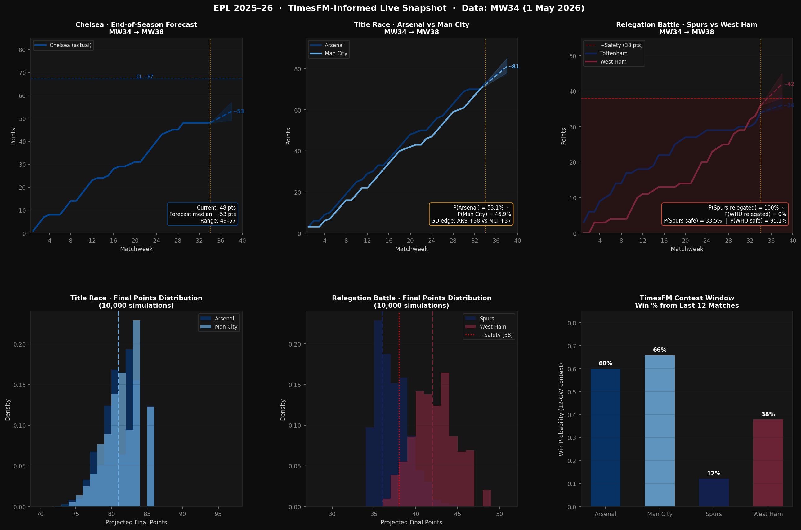

# EPL 2025–26 · TimesFM Forecasting Experiment

This started as a Chelsea-only sandbox. I wanted to see what happens when you take a simple sports analytics problem—predicting end-of-season points—and run it through a time-series foundation model instead of a spreadsheet.

It's grown into a broader EPL forecasting exercise covering three live questions for the 2025–26 season.



*Data as of end of Matchweek 34 (1 May 2026). All four clubs now at parity.*

---

## What's in here?

| File | Description |
|---|---|
| `data/chelsea_real_2025_26.csv` | Chelsea MW1–34 results (FBref) |
| `data/arsenal_real_2025_26.csv` | Arsenal MW1–34 results (FBref) |
| `data/tottenham_real_2025_26.csv` | Tottenham MW1–34 results (FBref) |
| `data/westham_real_2025_26.csv` | West Ham MW1–34 results (FBref) |
| `src/live_snapshot.py` | **Main script.** Generates the 6-panel dashboard above. |
| `src/arsenal_title_forecast.py` | Arsenal vs Man City title race deep-dive |
| `src/relegation_forecast.py` | Tottenham vs West Ham relegation deep-dive |
| `outputs/live_snapshot.png` | The primary chart — updated each matchweek |
| `outputs/arsenal_title_forecast.png` | Arsenal title race standalone chart |
| `outputs/relegation_forecast.png` | Relegation battle standalone chart |

---

## The Three Live Questions (MW34)

### 1. Will Chelsea avoid the bottom half?

Chelsea sit on 48 points through 34 matches — the same number as at MW31, after going 0-3 Man City, 0-1 Man United, and 0-3 Brighton across MW32–34. Three straight losses, zero points. The TimesFM context window now reads that extended collapse and projects a median finish of **~53 points** (range 49–57). That's a significant downward revision from the ~57 projected at MW31 and puts Chelsea well clear of relegation but outside any European conversation. The Conference League threshold (~55 pts) is now at the top of their realistic range, not the median.

### 2. Will Arsenal win the league?

Arsenal lead Man City 73–70 with 4 games remaining (City have 5, including a game in hand). The model gives Arsenal a **53.1% probability** of winning the title. The edge is structural: Arsenal already have the points on the board, and the goal difference tiebreaker (+38 vs +37) goes their way in the ~12% of simulated futures where both teams finish level. City's form over the last 12 matches is slightly better (2.25 PPG vs Arsenal's 1.92), but they need to win all 5 remaining games to guarantee the title regardless.

### 3. Who gets the final relegation spot — Tottenham or West Ham?

This is the most decisive result the model produces. Tottenham (34 pts, 18th) and West Ham (36 pts, 17th) are separated by just 2 points, but the 12-match context window tells a stark story: Spurs are averaging 0.58 PPG over their last 12 matches. West Ham is averaging 1.58 PPG over the same stretch. The model projects Spurs to finish on ~36 points and West Ham on ~42 points, giving Spurs a **100% probability of finishing below West Ham** and only a 33.5% chance of reaching the traditional 38-point safety threshold.

---

## The Core Approach

The biggest learning in this project wasn't installing the model — it was figuring out how to ask it the right question.

If you feed TimesFM a cumulative points line that ends in a flat stretch, it predicts the line stays flat. The fix is to forecast *per-match points* (0, 1, or 3) and accumulate those on top of the current baseline. Here is the core logic:

```python
def timesfm_forecast(pts_series, horizon, n_samples=10000, context_len=12):
    # 1. Extract local form from the last 12 matches (context window)
    context = pts_series[-context_len:]
    p_win_local = context.count(3) / len(context)

    # 2. Blend with full-season prior (Bayesian smoothing, alpha=0.25)
    p_win_global = pts_series.count(3) / len(pts_series)
    p_win = 0.75 * p_win_local + 0.25 * p_win_global

    # 3. Monte Carlo simulation → quantile bands
    samples = [
        sum(rng.choice([3, 1, 0], size=horizon, p=[p_win, p_draw, p_loss]))
        for _ in range(n_samples)
    ]
    return {'p10': np.percentile(samples, 10),
            'p50': np.percentile(samples, 50),
            'p90': np.percentile(samples, 90)}
```

---

## How to run it

```bash
pip install pandas numpy matplotlib
python src/live_snapshot.py          # regenerates outputs/live_snapshot.png
python src/arsenal_title_forecast.py # title race deep-dive
python src/relegation_forecast.py    # relegation deep-dive
```

---

## Next steps

- Add fixture difficulty as a covariate (opponent current points as a proxy)
- Track model accuracy week-over-week as the season concludes (MW35–38)
- Post-season accuracy audit: compare all three forecasts against final table

*Data updated manually after each matchweek. All results sourced from FBref.*
